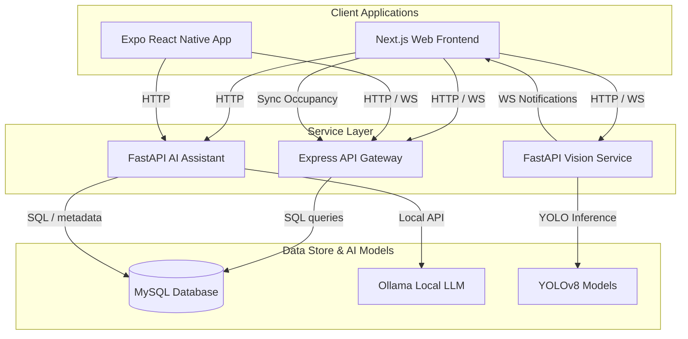

# ELABS — Smart Laboratory Management & LMS Platform

ELABS is a modern, full-stack monorepo platform designed for advanced academic laboratory surveillance, inventory check-outs, and learning management (LMS) at the Department of Electrical and Information Engineering (EIE), Faculty of Engineering, University of Ruhuna. 

The platform integrates real-time computer vision (YOLOv8 people tracking, pose estimation, and hazard detection), a database-connected AI Assistant (RAG and local LLM), a Next.js web application, and an Expo React Native mobile client.

---

## 📖 Table of Contents
1. [System Architecture](#-system-architecture)
2. [Technology Stack](#-technology-stack)
3. [Page & Screen Directory](#-page--screen-directory)
4. [Team Task Division (Roles)](#-team-task-division-roles)
5. [Local Development & Setup](#-local-development--setup)
6. [Database Schema & Entities](#-database-schema--entities)
7. [Advanced AI & Vision Features](#-advanced-ai--vision-features)

---

## 🏗️ System Architecture



---

## 💻 Technology Stack

The project is structured as a TypeScript and Python monorepo using npm workspaces:

| Component | Technology | Description |
| :--- | :--- | :--- |
| **Web Frontend** | Next.js (App Router), React, Lucide React, CSS Variables | High-performance, theme-responsive (dark/light) user dashboard. |
| **Mobile Client** | Expo, React Native, React Navigation, Ionicons | Handheld interface for scanning lab entries/exits and inventories. |
| **Express API** | Node.js, Express, TypeScript, Socket.IO | Database API gateway, real-time socket broadcaster, user authentication. |
| **AI Assistant** | Python, FastAPI, SQLAlchemy, SQLAlchemy connection pool | RAG (Retrieval-Augmented Generation) engine and SQL intent generator. |
| **Vision Service** | Python, FastAPI, OpenCV, YOLOv8, ByteTrack | Multithreaded RTSP/CCTV stream analyzer and event broadcaster. |
| **Database** | MySQL (with Connection Pooling) | Stores student records, lab groups, schedules, inventories, and logs. |

---

## 📱 Page & Screen Directory

### 1. Web Application (`packages/web`)
*   **Authentication & Settings:**
    *   `login/`: University login screen with institutional credentials.
    *   `change-password/`: Post-onboarding password configuration.
*   **Student & Admin Dashboards:**
    *   `dashboard/`: Displays upcoming academic lab sessions, active equipment borrows, and notifications.
    *   `admin/semester-groups/`: Admin utility to configure semesters, add courses, and register labs.
*   **Laboratory & LMS Hub:**
    *   `labs/[groupId]/`: Lists active course modules for a semester group.
    *   `labs/module/[moduleId]/`: Shows a module's lab practicals list, timetables, and checklists.
    *   `labs/session/[sessionId]/`: Interactive workspace for individual sessions containing PDFs and checklist items.
*   **Smart Inventory Workspace:**
    *   `inventory/`: Combines Equipment directories, Issue Borrow forms (with student index lookup), Active check-outs, and Personal borrow histories.
*   **Communication Center:**
    *   `messages/`: Real-time chat portal powered by Socket.IO.
    *   `notifications/`: Dynamic list of announce notices, overdue borrow warnings, and system logs.
*   **AI assistant Portal:**
    *   `ai/assistant/`: Interactive chat interface with clickable database prompt chips.
*   **Computer Vision Panel:**
    *   `vision/`: 3-Column command center: lab facility selector, live camera stream canvas, and active statistics (occupancy, safety alarms).

### 2. Mobile Client (`packages/mobile`)
*   **DashboardScreen:** Fast actions grid (Scan Entry, Scan Exit, Borrow, Return) and stats overview.
*   **Scan Screens (`ScanEntry`, `ScanExit`, `ScanBorrow`, `ScanReturn`):** QR/Barcode scanner screen using `expo-camera`.
*   **InventoryScreen:** Lists equipment and lets technicians check out items to students via direct lookup.
*   **MyLabsScreen & LabGroupScreen:** Student course navigation tree.
*   **MessagesScreen & NotificationsScreen:** Mobile socket notifications.
*   **SettingsScreen:** System preferences, dark mode toggle, and server configurations.

---

## 👥 Team Task Division (Roles)

To distribute work effectively and ensure concrete ownership during project evaluation, tasks are divided among four specialized roles:

### 1. Frontend Developer (`frontend`)
Responsible for building user-facing web and mobile interfaces, managing application state, styling, and real-time visualization overlays.
*   **Next.js Web Portal Architecture (`packages/web`):**
    *   Developed a fully responsive, state-synchronized dashboard using **Next.js (App Router)** and React Hooks.
    *   Designed a light/dark theming system utilizing CSS custom properties and global typography rules to ensure seamless visual transition and accessibility.
    *   Implemented the Learning Management System (LMS) workspace, comprising semester group list widgets, course modules, timetabled sessions, interactive practical checklists, and multi-file upload handlers with real-time progress indicators (implemented via Axios cancel tokens).
*   **Expo React Native Handheld Client (`packages/mobile`):**
    *   Engineered the cross-platform mobile client using **Expo SDK** and React Native, utilizing `@react-navigation/native-stack` and tab navigators for fluid transition flows.
    *   Secured session tokens and server preferences locally using `expo-secure-store`.
    *   Configured the QR and Barcode Scanning Module using `expo-camera`, implementing real-time barcode detection algorithms to process student laboratory entry check-ins, exit check-outs, and quick equipment return workflows.
*   **CCTV WebSocket Visualization & Canvas Engine:**
    *   Built an HTML5 Canvas rendering component in React to consume 30fps MJPEG streams from the Vision service.
    *   Developed custom path-drawing algorithms to render real-time bounding boxes (for person tracking) and 17-point skeletal pose estimation lines (for activity recognition) using raw vector graphics.
    *   Created a global notification broker using Socket.IO-client to receive and display real-time hazard warnings (fire, smoke, overcrowding) using micro-animated CSS toasts.

### 2. Backend Developer (`backend`)
Responsible for API services, database integrity, real-time gateways, authentication, and deployment containers.
*   **Database Engineering & Schema Management (`packages/shared`, `packages/api`):**
    *   Designed the relational schema in **MySQL**, managing normalization and indexing on foreign keys to optimize query latencies for user profiles, inventories, and borrow logs.
    *   Implemented secure data access layers using parameterized queries and a robust MySQL connection pool with automatic timeout handling.
*   **RESTful API Gateway & Security Gateway (`packages/api`):**
    *   Constructed the primary API gateway using **Node.js, Express, and TypeScript**.
    *   Built user authentication and authorization pipelines utilizing JSON Web Tokens (JWT) and `bcryptjs` password hashing, complete with a forced-onboarding password reconfiguration workflow.
    *   Created transactional routes for inventory borrows, student registration metadata lookups, and session checklists.
    *   Designed the `/attendance/sync-occupancy` endpoint to receive live vision-based student counts and synchronize active laboratory occupancy records in the database.
*   **Socket.IO Event Server & Dockerized DevOps:**
    *   Established a real-time event broadcasting server with Socket.IO, mapping separate namespaces for chat messaging, inventory alarms, and critical environmental notifications.
    *   Devised complete orchestration configurations using **Docker Compose** to containerize the Express API and MySQL services, creating standard volumes for database persistence.

### 3. AI Specialist (`ai`)
Responsible for natural language intent parsing, conversational assistants, RAG documents, and database tools.
*   **FastAPI Chatbot Server (`packages/ai`):**
    *   Developed the AI Assistant backend service using **FastAPI** and Python 3.10+.
    *   Configured **SQLAlchemy ORM** connection pools to safely query relational MySQL data directly from Python execution threads.
*   **Deterministic Prompt Routing & SQL Intent Engine:**
    *   Programmed a regex-based intent router to parse queries for direct database operations (e.g., searching inventory, counting active students, showing class timetables), achieving 100% deterministic accuracy for queries mapping to structured tables.
    *   Programmed a dynamic SQL generator using parameterized queries to execute read-only queries on the database, bypassing LLM hallucinations.
    *   Integrated local LLMs (e.g., Llama-3, Mistral) via the **Ollama** API for natural language generation.
*   **Retrieval-Augmented Generation (RAG) Pipeline:**
    *   Created a PDF manual parsing pipeline using sentence-transformer embeddings to index lab practical guides.
    *   Implemented semantic context retrieval based on cosine similarity, injecting student profile details (registration, semester group, current borrows) directly into the model system prompt for highly personalized interactions.

### 4. Vision Engineer (`vision`)
Responsible for camera feeds, deep learning tracking, pose estimation, and safety alarms.
*   **High-Performance Video Pipeline (`packages/vision`):**
    *   Programmed a multithreaded frame capturing pipeline in **Python** using **OpenCV** to consume RTSP feeds from lab CCTV cameras.
    *   Optimized frame decoding and processing queues to maintain low latency, broadcasting annotated frames as base64-encoded binary buffers over FastAPI WebSockets.
*   **YOLOv8 Object Detection & Tracking:**
    *   Integrated **Ultralytics YOLOv8** models inside worker threads to track active students within laboratory bounds.
    *   Integrated the **ByteTrack** multi-object tracker to assign persistent IDs to students, tracking their entry, dwell time, and exit trajectories.
*   **Pose Estimation & Fallback Environmental Heuristics:**
    *   Implemented YOLOv8-Pose models to extract 17 keypoints of the human skeleton, writing pose classification rules to detect activities such as standing, walking, and running.
    *   Designed custom HSV (Hue, Saturation, Value) color-space filtering fallback algorithms to detect fire and smoke regions in the video stream, enabling emergency detection even when internet access or deep-learning model downloads are interrupted.
    *   Triggered REST API sync requests and Socket.IO warnings based on tracking logs and hazard classifications.

---

## ⚡ Local Development & Setup

### Prerequisite Checklist
*   Node.js (v18+) & npm (v9+)
*   Python 3.10+
*   MySQL (installed and running on port 3306)

### Installation
1.  Clone the repository and copy environments:
    ```bash
    cp packages/api/.env.example packages/api/.env
    ```
2.  Initialize the dependencies:
    *   On Windows (PowerShell):
        ```powershell
        ./scripts/init-dev.ps1
        ```
    *   On Bash:
        ```bash
        bash scripts/init-dev.sh
        ```

### Starting Services
Start services locally inside their packages:
*   **API Service:** `npm --prefix packages/api run dev` (Port 4000)
*   **Web Portal:** `npm --prefix packages/web run dev` (Port 3000)
*   **Mobile App:** `npm --prefix packages/mobile run start`
*   **AI Service:** `python -m uvicorn src.main:app --host 127.0.0.1 --port 8001` (inside `packages/ai`)
*   **Vision Service:** `python -m uvicorn src.main:app --host 127.0.0.1 --port 8002` (inside `packages/vision`)

---

## 🗄️ Database Schema & Entities

The platform manages relations and tracks student states through a relational MySQL database. Below are the key tables and their roles:

*   **`users`:** Holds credentials, authentication metadata, hashes, and password change flags.
*   **`roles` & `user_roles`:** Implements Role-Based Access Control (RBAC) to distinguish between `ADMIN`, `LECTURER`, `TECHNICIAN`, and `STUDENT`.
*   **`student_profiles`:** Links student users to their registration number, EIE group code (e.g., `EE01`), and current semester.
*   **`labs`:** Defines the 8 major EIE laboratory facilities, floors, and capacities.
*   **`modules`:** Maps academic courses (e.g. *Digital Signal Processing*) to semesters.
*   **`timetable_slots`:** Contains the academic calendar, session dates, durations, and groups.
*   **`attendance_records`:** Logs live check-ins and exits for each lab section, synced in real-time by the vision service.
*   **`inventory_items`:** Lists laboratory instruments, equipment tags (e.g., `ELABS-SW-0001`), condition logs, and statuses.
*   **`borrow_records` & `borrow_items`:** Tracks student checkouts, due dates, return statuses, and issuing staff members.
*   **`notifications`:** Stores real-time alert logs (fire, smoke, entry warnings) and system notices.
*   **`broadcast_messages` & `message_recipients`:** Stores announcements from administrators to semester classes.

---

## ⚙️ Advanced AI & Vision Features

### 1. Computer Vision Pipeline Heuristics
The vision service operates in two detection stages:
*   **ByteTrack People Tracker:** Normalizes tracked centroid coordinates to a reference frame of 640 x 480. Centroid displacement over time determines standing, walking, or running classifications.
*   **Fire & Smoke Detection Heuristics:** Runs a fine-tuned YOLOv8 fire-detection model. In the absence of internet connectivity (where online models cannot be pulled), it activates a **color-space HSV fallback**:
    *   *Fire:* Hue range 0-25 and 155-180, high saturation, and value thresholds representing flame colors.
    *   *Smoke:* Low saturation, mid-value range representing grey haze structures covering >15% of the camera frame.

### 2. AI Assistant Tool Routing & Intent Engine
The Python FastAPI assistant does not solely rely on a local LLM, guaranteeing robust fallback mechanisms:
*   **Intent Regex Router:** Directly intercepts structured queries (e.g., *"locate ELABS-SW-0001"* or *"check out list"*) and translates them into parameterized SQL statements executed via SQLAlchemy connection pools.
*   **Proxy-Bypassing Ollama Integration:** When local LLMs are active, it feeds retrieved database context (upcoming classes, borrowed items, real-time lab counts) into the system prompt to customize and localize LLM answers.